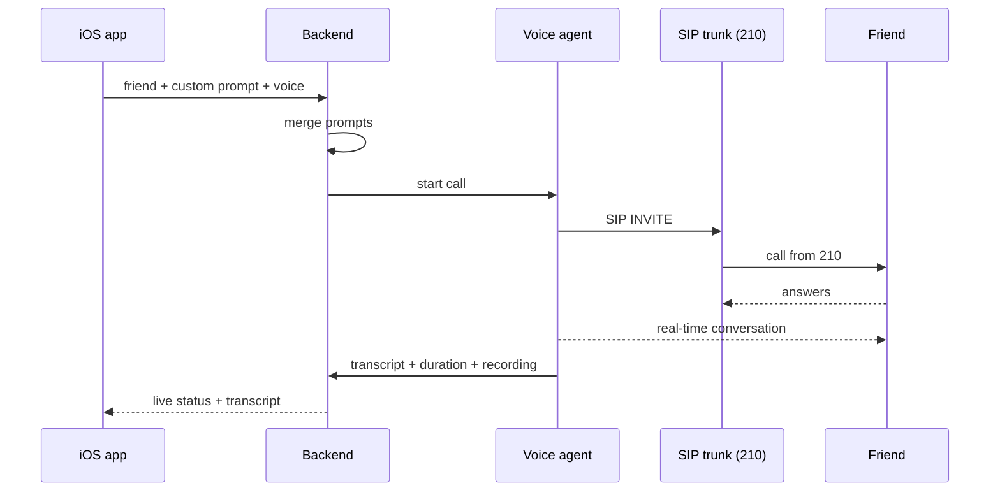
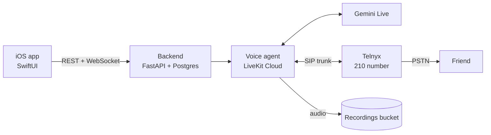

# PRD: AI Prank Caller (Level 1)

Sep 23, 2026 · @Alex

## Goal

Level 1 is an AI voice agent that calls friends from a Greek landline number (210) and runs a prank from a scenario I write for each call. Every call has two layers: my master system prompt (fixed) and a per-call custom prompt (who the friend is, what role the agent plays, what the joke is).

- **User:** only me, from a Swift iOS app (single user, personal tool).
- **Recipients:** friends.
- **Level 1 success:** one complete 1 to 3 minute call in natural Greek, with response latency under 1 second, started from a prompt in under 30 seconds.

## User flow

A call starts from my iOS app: pick a friend, write the scenario, tap Call.



The backend merges the two prompts, starts the call and streams what the agent says back to the app live.

## Functional requirements

| # | Requirement | Priority |
| --- | --- | --- |
| F1 | Outbound call from a Greek 210 landline (cloud SIP) to a Greek mobile | Must |
| F2 | Master system prompt applied to every call, editable from a config file | Must |
| F3 | Per-call custom prompt (scenario, role, friend's name, goal) | Must |
| F4 | Natural conversation in Greek with barge-in (stops talking when the friend interrupts) | Must |
| F5 | Agent hangs up by itself (hang-up tool) and there is a hard duration limit | Must |
| F6 | Recording of every call (audio + transcript) with playback in the iOS app | Must |
| F7 | Live transcript and a Hang up button in the iOS app | Should |
| F8 | Voice choice per call (male / female / style) | Should |
| F9 | Saved prompt templates (e.g. "wrong order", "fake call from the university") | Could |

After v1: many concurrent calls, with a live list of active calls in the app.

## Architecture & stack

Decision: Swift iOS app from day one, a Greek 210 landline over a cloud SIP trunk, Gemini Live for voice (about 15x cheaper than OpenAI Realtime), and everything in the cloud. No SIM, no hardware.



DIDWW was the first choice but does not offer outbound calling, so it is out. [Telnyx](https://telnyx.com/phone-numbers/greece) sells Greek local numbers ($1/month) and outbound Elastic SIP Trunking, and has an official [LiveKit setup guide](https://developers.telnyx.com/docs/voice/sip-trunking/livekit-configuration-guide). Greek local numbers require ID, a VAT number (ΑΦΜ) and proof of address dated within 3 months that matches the area code, and the buyer must be physically in Greece when ordering ([Telnyx Greece requirements](https://support.telnyx.com/en/articles/3739406-greece-did-requirements)). My Athens address covers 210.

| Layer | Level 1 choice | Alternative |
| --- | --- | --- |
| 210 number + SIP trunk | Telnyx, +30 21 number with outbound Elastic SIP Trunking | Twilio (also has a LiveKit guide) or Zadarma |
| Voice pipeline | LiveKit Agents + LiveKit SIP | Pipecat με SIP transport |
| Voice model | Gemini Live native audio (speech-to-speech) | gpt-realtime-mini (about $0.10 to $0.33 per minute) or STT + cheap LLM + TTS |
| Backend | FastAPI + Postgres, stateful (calls, prompts, templates, transcripts, recording metadata) | Spring Boot |
| Hosting | Online in the cloud (Fly.io or Railway) + LiveKit Cloud, recordings in a private bucket (e.g. Cloudflare R2) | Local Mac + ngrok, dev only |
| App | SwiftUI iOS app, sideloaded from Xcode | TestFlight |

Everything runs online: the Telnyx SIP trunk connects straight to LiveKit Cloud, with nothing at home.

Recording happens in the voice agent (LiveKit Egress or saving the audio frames), not at the carrier, and the iOS app plays it back.

**Concurrent calls (after v1):** one SIP trunk carries many simultaneous channels from the same 210 number, so scaling means buying channels, not hardware. LiveKit agents scale horizontally (one worker per call) and the backend needs a call queue. That is why the v1 schema already stores a call\_id per call.

## Prompt design

The final call prompt is master + per-call. The master sets tone and limits; the per-call prompt sets the scenario.

**Master system prompt (fixed, mine):**

- Speak natural, everyday Greek in short sentences.
- Stay in the scenario's role until it is time for the reveal.
- Never ask for passwords, cards, money or personal data.
- Never impersonate police, a hospital, a bank or a specific real person, and never tell anyone that someone close to them is hurt or in danger.
- If the other person seems anxious or upset in a bad way, or asks directly "are you a bot?", reveal immediately: "Φάρσα σου έκανε ο Αλέξανδρος, είμαι AI".
- End the call with the hang-up tool after the reveal or when the scenario is done.

**Per-call prompt (template):**

```markdown
Friend: {name}
Your role: {persona}, e.g. a delivery guy who lost a pizza
Scenario: {scenario}
Inside jokes / context: {context}
Reveal: {when and how you say it was a prank}
Max duration: {minutes}
```

## Guardrails

The number is tied to my ID through the provider's identity check, so these protect me too, not only my friends.

- **Hard duration cap:** 5 minutes, then automatic hang-up.
- **No voice cloning** of real people without their consent.
- **Recording with notice:** every call is recorded. At the reveal the agent says the call was recorded, and deletes it right away if the friend asks. In Greece, recording a conversation without consent can be a criminal matter (Article 370A of the Penal Code), so this step is not skipped. Recordings live in a private bucket that only my backend can access.

j

## Milestones & development time

v1 (M1 to M5) is about 40 to 65 hours of work: roughly 4 to 6 weeks solo at 10 to 15 hours a week. The estimate assumes first time with LiveKit SIP and SwiftUI; the Telnyx verification wait runs in parallel.

| Milestone | Deliverable | Effort |
| --- | --- | --- |
| M1: 210 line | Buy a 210 number on Telnyx (ID + VAT + address check), SIP trunk into LiveKit Cloud, test call | 3 to 5 h + verification wait |
| M2: Hello call | LiveKit agent calls my phone and speaks Greek through Gemini Live | 8 to 12 h |
| M3: Prompts, recording, state | Master + per-call merge, hang-up tool, hard cap, recording, Postgres schema | 10 to 15 h |
| M4: iOS app | SwiftUI: prompt form, Call, live transcript, recording playback | 15 to 25 h |
| M5: Deploy + first prank (v1) | Backend and agent live in the cloud, call a friend | 4 to 6 h |
| M6: Concurrent (after v1) | More SIP channels, call queue, active-calls list | 8 to 12 h |

**Non-goals for Level 1:** inbound calls, voice cloning, multiple users, App Store. Concurrent calls only after v1.

## Estimated cost

Gemini Live plus LiveKit come to about $0.03 per minute. The Telnyx rate to Greek mobiles is not confirmed yet and will likely be the biggest variable cost, so the all-in per-minute figure and the monthly total are unknown until I check it. Fixed costs are about $6 to $11 a month (number, hosting).

| Item | Cost | Type |
| --- | --- | --- |
| Gemini Live, audio in + out ([pricing](https://ai.google.dev/gemini-api/docs/pricing)) | \~$0.023 / min | Per minute |
| Telnyx outbound calls to Greek mobiles | Unknown, check Telnyx's rates-by-country page (SIP trunking starts at $0.005 / min, but that is a US baseline) | Per minute |
| LiveKit agent minutes ([pricing](https://livekit.com/pricing)) | Free up to 1,000 min, then $0.01 / min | Per minute |
| Telnyx 210 number ([pricing](https://telnyx.com/phone-numbers/greece)) | $1 / month | Fixed |
| LiveKit Cloud Build plan | $0 / month | Fixed |
| Backend + Postgres hosting (Fly.io or Railway) | \~$5 to $10 / month | Fixed |
| Recordings bucket (Cloudflare R2) | \~$0 within the free tier | Fixed |
| Apple Developer account | $0 with 7-day sideload, or $99 / year | Optional |

## Open questions

- [ ] How good is Gemini Live's Greek over 8 kHz phone audio, and what does Telnyx charge per minute to Greek mobiles?
- [ ] Does Telnyx's verification accept my Athens address, and how many days does it take?
- [ ] Does Telnyx let me use the 210 number as caller ID on outbound calls to Greek mobiles, and do Greek mobile carriers show it properly?
- [ ] How natural does Realtime's Greek sound compared to ElevenLabs?
- [ ] How many concurrent channels does the SIP trunk include in the base plan?
