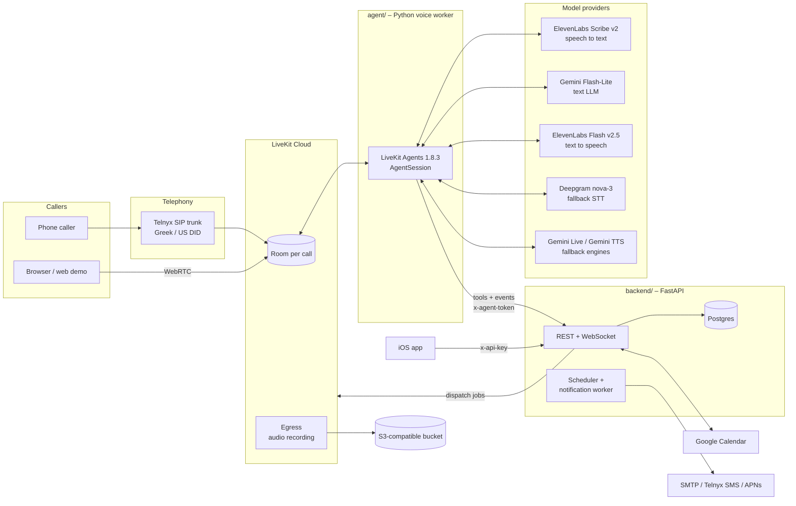
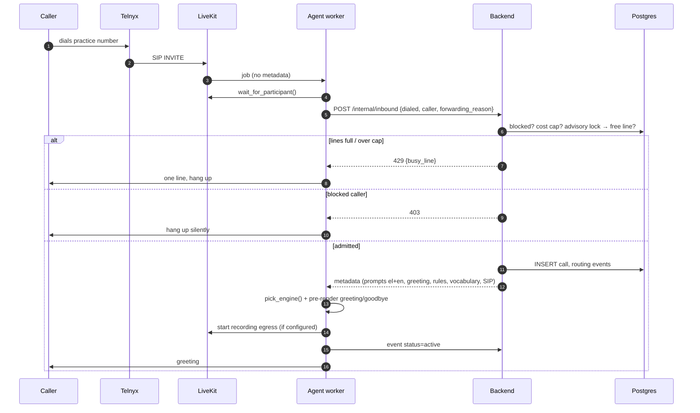
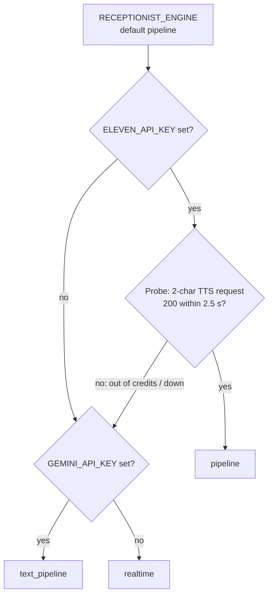
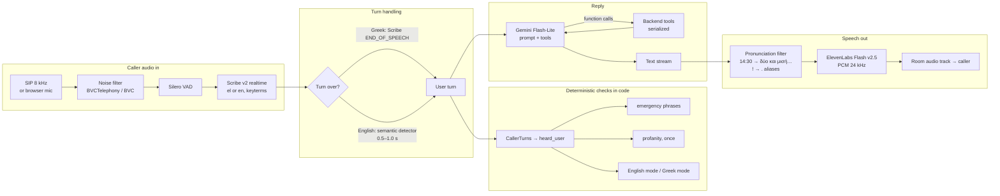
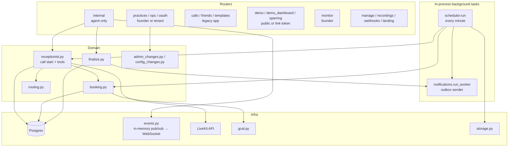
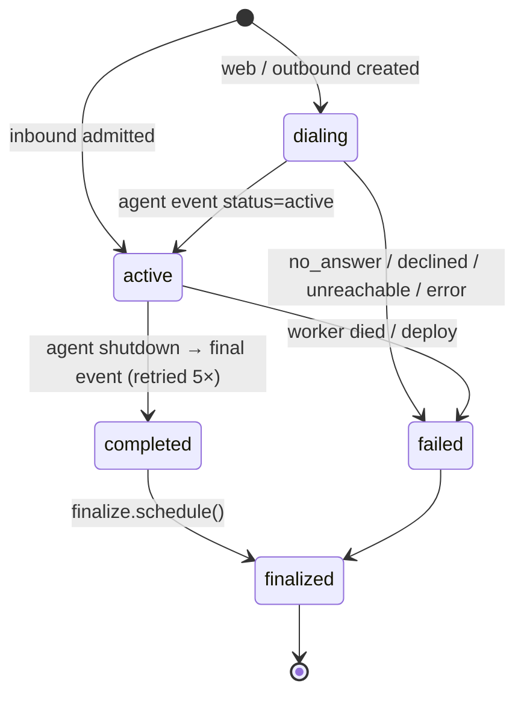

# AI Voice Receptionist

A Greek-first (and English) AI phone receptionist for small practices: dentists, physios, vets, barbers, beauty and aesthetic clinics, garages. It answers the phone, answers questions about the business, books, moves, cancels and confirms appointments, takes messages, and hands the caller to a person when needed. Staff follow everything from an iOS app.

> **Status:** active pilot. The features are built and covered by automated tests and evals, but provider setup and live acceptance (real phone calls, handoffs, recording disclosure) still have to be done for each deployment. See [PRD_STATUS.md](PRD_STATUS.md).

The repository started as an outbound "AI caller" (the Level 1 PRD). That flow still exists, but the receptionist is the product now. Some identifiers still use the old names on purpose: the LiveKit agent name `prank-caller`, the iOS target `PrankCaller`, the bundle ID `com.alekos.prankcaller`.

---

## Contents

1. [System at a glance](#system-at-a-glance)
2. [Repository layout](#repository-layout)
3. [How a call enters the system](#how-a-call-enters-the-system)
4. [The voice pipeline](#the-voice-pipeline)
5. [Turn taking: when the agent speaks](#turn-taking-when-the-agent-speaks)
6. [What the model may decide (and what it may not)](#what-the-model-may-decide-and-what-it-may-not)
7. [Booking safety: offer, readback, yes](#booking-safety-offer-readback-yes)
8. [Language handling](#language-handling)
9. [Speech output: voices, pronunciation, pre-rendered lines](#speech-output-voices-pronunciation-pre-rendered-lines)
10. [Guards that run in code](#guards-that-run-in-code)
11. [Handoff to a human](#handoff-to-a-human)
12. [Recording and privacy](#recording-and-privacy)
13. [Backend architecture](#backend-architecture)
14. [Call lifecycle in the database](#call-lifecycle-in-the-database)
15. [Telemetry, latency and cost](#telemetry-latency-and-cost)
16. [Evals and tests](#evals-and-tests)
17. [Running locally](#running-locally)
18. [Configuration reference](#configuration-reference)
19. [Deployment](#deployment)
20. [Known limitations and lessons learned](#known-limitations-and-lessons-learned)

---

## System at a glance



The design has three parts:

| Part | Does | Never does |
|---|---|---|
| **Voice worker** (`agent/`) | Listens, talks, decides when a turn is over, runs safety checks on the caller's words, and calls tools | Touch the database or work out dates and free times itself |
| **Backend** (`backend/`) | Owns every business decision: routing rules, date parsing, free slots, booking under a lock, confirmations, notifications, summaries, costs | Talk to the caller |
| **iOS app** (`ios/`) | Shows staff the calls, transcripts, recordings, appointments, messages and metrics; lets staff join a live call | Talk to LiveKit or the model providers, except to join a handoff room |

The rule that runs through the whole codebase: **the language model only passes on what the caller said; code decides what is true.** Many of the guards below exist because a real call or an eval showed the model inventing a date, a surname, a booking or a language switch.

---

## Repository layout

```
voiceagent/
├── agent/                      LiveKit voice worker
│   ├── agent.py                Engines, agents, tools, call orchestration (the core)
│   ├── speech.py               Delivery settings, Greek time-to-words, pronunciation aliases
│   ├── opening.py              Opening line written and voiced during the ring; cached fixed lines
│   ├── voices.py               App voice keys -> ElevenLabs / Gemini / OpenAI voices
│   ├── fillers.py              "Μάλιστα…", "One moment…" fillers (outbound pipeline only)
│   ├── telemetry.py            Content-free timing/usage events, batched to the backend
│   ├── evals/                  Eval Suite (evals.json, run_evals.py, practice.json)
│   ├── scripts/                Scripted audio calls, live call monitor
│   └── test_*.py               Unit tests
├── backend/
│   ├── app/
│   │   ├── main.py             FastAPI app, routers, startup of scheduler/notifier
│   │   ├── receptionist.py     Call start, agent metadata, every agent tool
│   │   ├── booking.py          Dates in words -> dates, slots, per-staff calendars, book/move/cancel
│   │   ├── routing.py          Routing rules R1–R9, emergency/profanity/off-topic, routing log
│   │   ├── finalize.py         Outcome, Gemini summary, cost, one email per call
│   │   ├── scheduler.py        Digests, monthly report, reminders, retention, stale calls, health
│   │   ├── notifications.py    Outbox: SMTP email, Telnyx SMS, APNs push
│   │   ├── costs.py            Versioned price list -> per-call cost breakdown
│   │   ├── telemetry.py        Validates and stores worker telemetry
│   │   ├── crypto.py           AES-GCM / AES-SIV field encryption
│   │   ├── storage.py          Recording bucket: seal, presign, delete queue
│   │   ├── gcal.py, ical_feed.py, google_oauth.py   Calendars
│   │   ├── prompts.py          Builds the receptionist prompt from practice data
│   │   ├── livekit_dispatch.py, dispatcher.py       Legacy outbound flow
│   │   └── routers/            calls, practices, demo, demo_dashboard, sparring, monitor,
│   │                           internal (agent-only), ops, manage, oauth, webhooks, landing…
│   ├── alembic/versions/       Migrations 0001–0030
│   ├── config/                 Prompts (el/en), vertical templates, pricing.json, demo practices
│   ├── scripts/                setup_inbound.py, setup_failover.py, setup_dental_demo.py
│   └── tests/                  Pytest (unit + Postgres integration)
├── ios/                        SwiftUI app (XcodeGen project.yml)
├── docs/                       build-progress, call-routing, evals, telemetry, dental-demo
├── .github/workflows/          backend-ci, agent-ci, ios-ci, evals
├── ASTRA.md                    Company priorities and working principles
├── PRD_STATUS.md               What is verified, what is not
└── docker-compose.yml          Local Postgres (port 5433)
```

---

## How a call enters the system

Every conversation happens in a **LiveKit room** with one agent job. The worker registers as `prank-caller` (or `AGENT_NAME`) and handles six kinds of job:

| Entry | How the job is created | Metadata the agent gets |
|---|---|---|
| **Inbound phone call** | Caller dials the practice's DID → Telnyx → LiveKit SIP dispatch rule creates a room and job | None. The agent waits for the SIP participant, reads `sip.trunkPhoneNumber`, `sip.phoneNumber`, `sip.forwardingReason`, and asks the backend `POST /internal/inbound` |
| **Web demo** | Browser opens `/demo/<slug>` (or the shareable demo dashboard) → `POST /demo/<slug>/session` → backend creates the call, dispatches the agent, returns a room token | Full receptionist metadata, `direction: "web"` |
| **Outbound reminder / waitlist / daily test call** | Scheduler queues it → `receptionist.dispatch_outbound` | Receptionist metadata plus `dial_number`; the agent dials out through the SIP trunk |
| **Legacy outbound call** | iOS "new call" → `routers/calls.py` → `livekit_dispatch.dispatch_call` | Merged prompt, number, voice, language, duration cap |
| **Sparring page** | Internal page; the agent plays an aggressive caller for practice | `sparring: true`: shorter endpointing plus heckles |
| **Health check** | Backend's synthetic probe (OP1) | `health_check` token. The agent acknowledges it and exits without joining |



**Admission control** happens in `receptionist.start_call`, in this order:

1. Callers on the practice's blocked list get no answer.
2. The month's cost is checked against the practice cap.
3. A transaction takes a Postgres advisory lock (`admission:<practice_id>`), counts active calls, and reserves a line, so two simultaneous calls can't both take the last free one.

---

## The voice pipeline

### Engines

The worker has four engines. Receptionist calls use `RECEPTIONIST_ENGINE` and legacy outbound calls use `AGENT_ENGINE`.

| Engine | Ear (STT) | Brain | Voice (TTS) | Turn ends on | Use |
|---|---|---|---|---|---|
| **`pipeline`** (default) | ElevenLabs **Scribe v2 realtime**, pinned to the call language, server VAD 0.7 s, business keyterms | **Gemini 3.5 Flash-Lite** (`thinking_level=minimal`, temp 0.9) with tools | ElevenLabs **Flash v2.5**, PCM 24 kHz, speed 0.93 | Greek: Scribe's end-of-speech event. English: LiveKit's semantic turn detector | Main receptionist engine |
| **`text_pipeline`** | **Deepgram nova-3** via LiveKit Inference, with a keyterm glossary | Same Gemini Flash-Lite | **Gemini TTS** (flash-lite-tts, falls back to flash-tts) | Deepgram's final transcript, 0.5 s fixed delay | Fallback when ElevenLabs is missing, out of credits or down |
| **`realtime`** | Gemini Live hears the audio directly. Deepgram runs alongside it only for the transcript | **Gemini 3.8 Live** (speech to speech, language pinned) | Gemini Live | Gemini's VAD, 700 ms silence, low sensitivity | Legacy engine and last fallback |
| **`openai`** | gpt-4o-transcribe (transcript only) | **gpt-realtime-2.1** | OpenAI Realtime | Server VAD | Experiment. Off: its Greek was no better than Gemini's |

**Engine selection at call start** (`pick_engine`):



The probe costs about one ElevenLabs credit per call. It exists because on 2026-09-25 the account ran out of credits and calls went silent.

### One turn through the `pipeline` engine



Details that matter:

- **Prewarming.** STT and TTS connections open while the phone rings or the call is being set up, not on the first reply. Silero VAD loads once per worker process (`prewarm`).
- **Preemptive generation.** The LLM starts on the partial transcript before the turn is confirmed over. TTS is held back (`preemptive_tts: False`) so the agent doesn't talk over a caller who is still speaking.
- **Interruptions (barge-in).** The caller only interrupts the agent with at least 0.6 s of speech and 2 words, so a cough or a quick "ναι" doesn't cut a reply off. If an interruption turns out to be false, the agent resumes after 1.5 s.
- **Vocabulary.** Scribe gets everyday Greek ("ρε", "κομπλέ", "ραντεβουδάκι"), the weekday names (Scribe once heard "Τετάρτη" as "Δευτέρα") and the business's own names: practice, staff, aliases, services. Terms are split to ≤20 characters, because Scribe rejects the whole session if any keyterm is longer, and capped at 100. Deepgram gets a separate, tighter glossary: at most 40 terms and 120 words.
- **Failed replies.** If Gemini returns an unrecoverable error after the SDK's retries (empty or malformed completions were seen in evals), the agent says "Συγγνώμη, μπορείτε να το πείτε ξανά;" once per caller turn instead of staying silent.

### The `realtime` engine's split ear

Gemini Live understands Greek audio well, but its own transcript of Greek came out as Portuguese, Spanish or German fragments. So on `realtime`:

- Gemini hears the raw audio and produces the reply.
- **Deepgram nova-3 runs in parallel** and supplies the caller's transcript lines. These lines feed the code checks (emergency, language) and the stored transcript.
- `CallerTurns` joins Deepgram's final segments until Gemini commits the turn. If Deepgram is late by more than 1.5 s, or fails, it falls back to Gemini's text.
- On the web demo, any non-Greek-script "caller" line on a Greek call is dropped unless it is an "English" request.

---

## Turn taking: when the agent speaks

| Setting | Default | Where | Effect |
|---|---|---|---|
| `SCRIBE_SILENCE_SECS` | 0.7 | Scribe server VAD | Pause that ends a transcribed segment. 0.3 split normal sentences into fragments |
| Greek pipeline endpointing | `stt` mode, min delay **0** | `build_session` | Scribe's end-of-speech *is* the turn end. The local turn model has no Greek, so it used to wait for `max_delay` every turn |
| English pipeline endpointing | dynamic 0.5–1.0 s | `ENDPOINT_MIN_DELAY`, `TURN_MAX_DELAY_MS` | LiveKit Inference semantic turn detector (`local_fallback=False`) |
| After a readback | 0.8–1.6 s | `CONFIRM_MIN_DELAY`, `CONFIRM_MAX_DELAY` | Gives "Ναι… ολόσωστα" time to finish instead of being cut after "Ναι…". Restored after the next turn |
| `REALTIME_SILENCE_MS` | 700 | Gemini Live / OpenAI VAD | Silence that ends a turn on the realtime engines |
| Web demo opening | mic muted during greeting | `run_receptionist` | An early browser-mic sound made Gemini restart its greeting |
| Outbound opening | wait up to 4 s for "Εμπρός;" | `GREETING_WAIT_SECONDS` | Lets the callee speak first and gives voicemail detection a chance |

Measured end of speech → first audio: about 1.5–1.8 s on the Greek pipeline before the Scribe end-of-speech change, and about 2 s on realtime. Current numbers live in `/monitor`.

---

## What the model may decide (and what it may not)

The receptionist agent (`ReceptionistAgent`) exposes these tools. Each one is a thin HTTP call to `POST /internal/calls/{call_id}/tools/{name}`. The backend validates it, writes it, logs it and returns a small JSON reply the model reads.

| Tool | Model supplies | Backend decides |
|---|---|---|
| `route_call` | intent (`book`, `change`, `cancel`, `confirm`, `question`, `message`, `human`, `emergency`, `unclear`, `off_topic`), staff and department as spoken | The path (booking, call center, message, handoff, refuse, end call) and the `next` instruction. After-hours rules, strike counts, staff alias matching |
| `check_availability` | **The caller's own words** for the day ("την Τρίτη το απόγευμα"), service, staff, `after`/`before` for "earlier"/"later" | Parsing words to a date, opening hours, closures, staff leave, per-staff busy intervals, Google Calendar busy times, next free days. Every offer is stored |
| `prepare_action` | action, date, time, service, name, staff, appointment, alternative phone | Checks the slot was really offered and builds the **readback sentence from trusted data** |
| `book_appointment` / `reschedule_appointment` / `cancel_appointment` | the same details | Writes only with an armed confirmation and a clear yes. Serialized under an advisory lock, re-checked, idempotent per call and slot |
| `find_appointments`, `confirm_appointment` | phone (optional) | Upcoming appointments for the caller. IDs must come from this lookup |
| `take_message` | name, phone, reason, urgent | Message row, notifications |
| `transfer_to_human` | target | SIP or in-app handoff, timeout, fallback |
| `add_to_waitlist` | when, service, name | Waitlist entry. A cancellation later triggers a callback offer |
| `admin_login` / `admin_change` / `admin_confirm` | PIN, spoken change, yes/no | Staff on their registered mobile can change hours, closures, leave or prices by voice. Recording stops first and PINs are scrubbed from the transcript |
| `stop_recording` | — | Stops egress. The backend deletes whatever was uploaded |

Two more protections in the agent:

- **Tools run one at a time.** Gemini sometimes emits parallel calls, such as `check_availability` and `prepare_action` in one turn. Run concurrently, the readback was built before the new offer was saved and was rejected. `ReceptionistCall.tool` takes an `asyncio.Lock`.
- **The first availability lookup on an inbound or web call uses the caller's actual transcript**, not the model's `when` argument. If the STT stopped before the day was spoken, the backend returns `no_date` instead of accepting a day the model guessed. A demo call once got an invented "σήμερα".

---

## Booking safety: offer, readback, yes

The model cannot book something the backend did not offer, or something the caller did not clearly accept.

```mermaid
sequenceDiagram
    autonumber
    participant C as Caller
    participant M as Gemini
    participant A as Agent code
    participant B as Backend

    C->>M: "Θέλω καθαρισμό την Τρίτη το απόγευμα"
    M->>A: route_call(book)
    A->>B: /tools/route_call
    B-->>M: path=booking, next=check_availability
    M->>A: check_availability(when=caller's words, service)
    A->>B: /tools/check_availability
    B->>B: resolve date, free slots, store OFFER event
    B-->>M: date, free_times [17:00, 17:30, 18:00]
    M->>C: offers 2–3 of those times
    C->>M: "στις πέντε και μισή, Γιάννης Παπαδάκης"
    M->>A: prepare_action(book, 17:30, name)
    A->>A: name_from_transcript() overrides an invented surname
    A->>B: /tools/prepare_action
    B->>B: was it offered in the last 5 min? build readback, store CONFIRMATION
    B-->>A: confirmation_id, say="Να επιβεβαιώσω: …. Σωστά;"
    A->>C: speaks readback (not interruptible, not from the LLM)
    A->>A: after playout: arm confirmation, longer endpointing
    C->>A: "Ναι, σωστά"
    M->>A: book_appointment(...)
    A->>B: + confirmation_id + confirmation_text = caller's last turn
    B->>B: clear yes? (no "όχι/δεν/but") · same details · < 4 min old
    B->>B: advisory lock, re-check slot, idempotency key, write, Google Calendar
    B-->>M: booked: true, spoken description
```

Key properties:

- **The readback is spoken by code** (`session.say`), not generated by the LLM, so the caller hears exactly the stored date, time, service, staff and name.
- **The "yes" is the caller's transcribed words**, checked by `_affirmative` in the backend. The model's opinion of what the caller said doesn't count. EVAL-011 ("no booking without the caller's yes") makes every check critical.
- **Confirmation arms only after the readback finished playing**, and only a *later* caller turn counts.
- **Moves keep the same staff member.** Offering "anyone free" for a move once produced a `slot_taken` after the caller had said yes.

---

## Language handling

Rules (the owner's, 2026-09-25):

- **Every call starts in Greek**, whatever the caller's number. English starts only when the caller asks: "English mode", "ίνγκλις", "αγγλικά", "can you speak English", "switch to English". "Greek mode" or "ελληνικά" switches back.
- **The switch is detected in code** (`wants_language`), never by the model. Gemini Live used to "hear" casual Greek as Italian or Spanish and switch or refuse on its own. Long sentences that merely *mention* Greek ("Did you hear me speaking Greek?") are not requests.
- **A switch builds a whole new agent.** The backend authorizes and logs the switch (`set_language`, rule R7). The agent is then replaced by one with Scribe and the voice pinned to the new language and the prompt in that language, and the chat history carries over. The code waits for the SDK's internal agent swap to finish before speaking, because speaking too early landed on the draining old agent and the caller heard nothing.
- The prompt says "Speak ONLY Greek; anything that sounds foreign is bad audio." Without that rule Gemini drifted into Spanish or Chinese.

---

## Speech output: voices, pronunciation, pre-rendered lines

**Voices** (`voices.py`). The app and backend only know stable keys (`Kore`, `Zubenelgenubi`, `Puck`, …), and each engine maps them to its own voices:

- **Greek calls use native Greek ElevenLabs voices**: female `Kore` → *Aria* (the default) and male `Zubenelgenubi` → *Fatsis*. The English premade voices sounded foreign, almost Cypriot, in Greek. A male/female toggle sits in the iOS settings (`PUT /practices/<id>/voice`) and on the web demo.
- `ELEVENLABS_VOICE_MAP`, `ELEVENLABS_VOICE_MAP_EL` and `ELEVENLABS_VOICE_MAP_EN` override the defaults. The demo dashboard offers four extra voice keys (`eleven_sarah`, `eleven_jessica`, `eleven_george`, `eleven_brian`).

**Pronunciation filter** (`speech.Pronunciation`). This runs on the text stream between the LLM and TTS only. Stored transcripts and booking data keep the original spelling.

- Greek clock times are spoken as words: `17:30` → "πέντε και μισή το απόγευμα".
- `!` becomes `.` in Greek. A receptionist doesn't exclaim, and Greek TTS broke up "Παρακαλώ πολύ! Καλό σας απόγευμα."
- `TTS_PRONUNCIATION_ALIASES` replaces whole words, e.g. `{"el":{"OpenAI":"Όπεν έι άι"}}`. Matching survives words split across streamed chunks.
- The prompt also asks for slower, clearly articulated speech, dates and amounts in words, and phone numbers digit by digit.

**Pre-rendered fixed lines** (`opening.py`). The greeting, the greeting without the recording notice, and the goodbye are known before the call starts. Streamed through Flash v2.5 they sounded rushed, and an English hint in a Greek greeting was read in a Greek accent. So:

- they are voiced whole with `eleven_multilingual_v2`, split into Greek and English segments, each voiced in its own language;
- the audio is cached on disk in the worker's temp dir and keyed by text, voice, model and settings, so later calls reuse it;
- a call plays the cached audio if it is ready within 2 s. Otherwise it streams the line normally.

**Legacy outbound opening.** On the outbound flow the agent writes and voices its first line *while the phone rings*. It plays that line the moment the callee says "Εμπρός;", or after 4 s of silence.

**Fillers** (`fillers.py`). On the outbound pipeline, if the reply hasn't started 0.5 s after the caller stops, the agent prefixes it with "Μάλιστα…" or "One moment…". There is at most one filler every 4 s and none before a goodbye. If the model then starts with its own filler, that one is stripped. Fillers are **off for receptionist calls**, where the prompt asks for direct answers instead.

---

## Guards that run in code

| Guard | Trigger | Action |
|---|---|---|
| **Emergency** (R5, health verticals) | An emergency phrase in the caller's words, checked on every final STT segment and not only at turn end | Interrupt, say the emergency script, take an urgent message, notify |
| **Profanity** | Abuse aimed at the agent (casual "γαμώτο" is ignored) | One calm, polite reminder, once per call |
| **Off-topic strikes** | `route_call(off_topic)`: trolling, insults, jokes, general questions | 1st time: warn. 2nd: say the call will end. 3rd: the backend says `end_call` and the agent says the closing line and hangs up |
| **Unclear twice** | `route_call(unclear)` | Ask one clarifying question. The second time, offer to take a message |
| **Repetition** | 3 agent turns in a row ≥90% similar | Hang up instead of looping |
| **Duration cap** | `MAX_CALL_DURATION_SECONDS` (default 300) | At `max(cap − 25 s, 75% of cap)` tell the model to wrap up. At the cap, disconnect and flag `over_duration` |
| **Busy / cost cap / blocked** | At admission | One line and hang up, or a silent hang-up |
| **Spam** | 3 short, silent calls from one number in a day | Number blocked (OP10) |
| **Name protection** | A clean 2–3-word name, or "με λένε …", in the last caller turn | Overrides the model's `customer_name`. Realtime models sometimes invented a surname |

---

## Handoff to a human

`route_call(human)` or `transfer_to_human`, then the backend picks the target and mode from the practice's rules:

- **SIP transfer.** The agent says "putting you through", waits 2.5 s, then dials the staff number *into the same room* (`create_sip_participant`, wait until answered, timeout). If the staff member answers, the agent leaves and the room keeps going.
- **In-app join.** Staff get a push or live update and join from the iOS app as `staff-join-*` (LiveKit Swift SDK). The agent says "Σας συνδέω τώρα" and steps out.
- **Nobody answers.** The practice's `transfer_failure` applies: `return_to_ai`, `take_message` or `collect_callback`.

If the backend's routing returns a `handoff` path, the agent starts the transfer itself, in code. The model used to *announce* transfers without calling the tool, leaving the caller waiting for nobody.

---

## Recording and privacy

- **Recording.** A LiveKit room-composite egress, audio only, writes MP4 to any S3-compatible bucket. Web demo calls are never recorded. If storage isn't configured or egress fails, the greeting without the recording notice is used instead.
- **Stopping and deleting.** On request (`stop_recording`, `delete_recording`) the egress stops. The backend queues deletion of the file and removes the transcript and telemetry for that call.
- **Encryption.** With `DATA_ENCRYPTION_KEY` set, sensitive columns are encrypted: AES-GCM for random fields and AES-SIV for searchable ones such as phone numbers. Recordings are sealed (`.enc`). Without the key the backend logs a warning at startup.
- **Retention.** A daily job deletes transcripts and telemetry according to each practice's settings. Offboarded practices are purged after 30 days. Data export and erasure requests are handled in `data_requests.py`.
- **Auth.** Every route except `/health` and the public demo and landing pages needs a key:
  - `x-api-key` with `APP_API_TOKEN` (legacy dialer), `ADMIN_API_TOKEN` (founder) or a per-practice tenant key;
  - `x-agent-token` for the worker (`INTERNAL_API_TOKEN`).
  
  Tenant keys see only their own practice; anything else returns 404. Demo dashboard links are random tokens stored as SHA-256 hashes.
- **Before real callers:** add a recording disclosure or turn recording off (Greek law generally requires one), review retention, and run live handoff tests.

---

## Backend architecture

FastAPI, async SQLAlchemy and asyncpg on Postgres, with Alembic migrations 0001–0030. Migrations run on container start.



**Main modules:**

- **`booking.py`** turns spoken dates into dates: weekday stems, "αύριο", "μεθαύριο", "next Monday", part of day ("απόγευμα"), "νωρίτερα" and "αργότερα" relative to the last offer, explicit day and month. It also computes opening hours per practice and per staff member, closures and leave, busy intervals from the database and Google Calendar, and the next free days within `max_days_ahead`. Writes take a per-practice advisory lock, re-check the slot inside the lock, and are idempotent per call, slot, service and staff.
- **`routing.py`** implements the routing rules:
  - R1: intent paths;
  - R2: staff aliases and "anyone free";
  - R3: after-hours booking;
  - R5: emergency;
  - R6: handoff;
  - R7: language;
  - R8: departments;
  - plus off-topic strikes.
  
  Every decision is written to `routing_events`, so each call has an auditable trail, and offers and confirmations live there too.
- **`prompts.py`** builds the prompt from `config/receptionist_prompt.md` (`.en.md` for English) together with the practice's name, services and prices, staff, hours, the current state (open, closed, opens at), the caller's known name and upcoming appointments, and the purpose of an outbound call.
- **`finalize.py`** runs after the call. It decides the outcome (`booked`, `message_taken`, `transferred`, `info_given`, `abandoned`, `failed`…), writes a Gemini summary (with a safe fallback when Gemini fails), computes the cost and queues one email to the business.
- **`scheduler.py`** runs once a minute:
  - the 20:00 daily digest and the monthly report;
  - appointment reminders, which are outbound calls;
  - waitlist offers;
  - retention;
  - stale-call cleanup;
  - retries of failed notifications and recovery of stuck finalizations;
  - Google Calendar reconciliation every 5 minutes;
  - a daily synthetic test call and the health checks.
- **`notifications.py`** is an outbox table. It sends SMTP email, Telnyx SMS and APNs push, with up to 8 attempts and dedupe keys. Channels that aren't configured are skipped.
- **`events.py`** is in-memory pub/sub behind the WebSockets the iOS app and monitor use. Because of this the backend must run as **a single replica**.

**Practice setup.** `GET /verticals/<id>` returns a template from `config/verticals/*.json` (dentist, physio, vet, barber, beauty, aesthetic, auto). Post it to `/practices` with the name, numbers and notification emails, then add staff. Existing-number forwarding is described in [docs/call-routing.md](docs/call-routing.md).

---

## Call lifecycle in the database



While the call runs, the agent posts events to `/internal/calls/{id}/events`. Each event can carry:

- status changes;
- transcript lines (`friend` or `agent`);
- flags (`over_duration`, `recording_refused`, `tool_error`);
- the recording key;
- the median latency;
- a delete request.

A finished call can't be reopened, so a late "failed" from a dying worker is ignored. When a call ends, the backend recomputes the cost, starts finalization and lets the next queued legacy call go.

---

## Telemetry, latency and cost

- **Worker telemetry** (`agent/telemetry.py`) is a strict allowlist of timing events and **contains no content**:
  - caller speech start and stop;
  - agent state changes;
  - SDK message metrics: transcription delay, end-of-turn delay, LLM time to first token, TTS time to first byte, end-to-end latency;
  - tool-request spans and transfer spans;
  - "answer started", which is separate from first sound because first sound can be a filler.
  
  Events go out in batches of up to 50 from a 1,000-event queue, with 3 retries and a 5 s drain at shutdown.
- **Usage → cost.** At the end of a session one `usage_reported` event carries per-provider totals: LLM tokens, STT seconds, TTS characters, turn-detector requests. The backend prices it with the dated versions in `config/pricing.json`, adds telephony and LiveKit minutes, and stores `calls.cost_breakdown`. An unknown rate yields `complete: false`, never a made-up number.
- **Live monitor.** `<backend>/monitor` with the founder key shows reply times (last, p50, p95), stage timings, tool and transfer spans, and a merged log of transcript, routing and timing events. In worker logs, search for `latency:`, `reply after` and `tool_request`.
- **Demo dashboard.** A revocable link with an optional no-expiry mode. It shows the call UI, public prices and hours, live metrics and cost explanations for calls started from that link only. See [docs/dental-demo.md](docs/dental-demo.md).

Details are in [docs/telemetry.md](docs/telemetry.md).

---

## Evals and tests

**Eval Suite** ([docs/evals.md](docs/evals.md)). `agent/evals/run_evals.py` drives the real `ReceptionistAgent` with the production prompt, the same tools and the same `text_llm()`. A scripted caller speaks against a local backend and Postgres. **Pass or fail comes from database state, not an LLM judge**:

- appointments created;
- status after a move or cancellation;
- handoffs and messages saved;
- tool order.

| ID | Case |
|---|---|
| EVAL-001 | New patient booking, golden path |
| EVAL-002 | Hours, prices, services |
| EVAL-003 | Caller changes their mind mid-booking |
| EVAL-004 | Reschedule existing appointment |
| EVAL-005 | Cancel existing appointment |
| EVAL-006 | Fast Greek + barge-in (audio only) |
| EVAL-007 | Greek/English switching + difficult name |
| EVAL-008 | Requested time unavailable |
| EVAL-009 | Transfer with failed-transfer fallback |
| EVAL-010 | Ambiguous caller needing clarification |
| EVAL-011 | No booking without the caller's yes (all checks critical) |

`--repeat N` turns the suite into a benchmark: pass rate, critical failures, p50/p95/p99 turn time, tool error rate and cost per call. `--baseline` fails the run if the critical pass rate drops. The suite runs in CI (`evals.yml`) when `GEMINI_API_KEY` is set.

Text evals don't cover recognition, turn detection, barge-in or TTS. For those, `agent/scripts/scripted_calls.py` places WebRTC calls with a synthetic caller voice against a deployed backend and worker.

**Tests:**

```bash
# backend (Postgres tests run when TEST_DATABASE_URL is set, otherwise they skip)
cd backend
uv run --python 3.12 --with-requirements requirements.txt \
  --with pytest --with pytest-asyncio pytest -q -c pytest.ini
```

```bash
# agent
cd agent
uv run --python 3.12 --with-requirements requirements.txt \
  --with pytest --with pytest-asyncio python -m pytest -q test_*.py
```

CI runs backend tests against Postgres, the agent tests, an iOS Simulator build, and the evals. `main` is protected.

---

## Running locally

**Requirements:**

- Python 3.12 and [uv](https://docs.astral.sh/uv/). Python 3.14 breaks venv/ensurepip here.
- Docker for Postgres.
- LiveKit Cloud, Gemini and ElevenLabs keys, plus Telnyx for real phone calls.
- Xcode and XcodeGen for the iOS app.

**Steps:**

1. Copy `.env.example` to `.env` and fill it in. Use distinct, long values for `APP_API_TOKEN`, `ADMIN_API_TOKEN` and `INTERNAL_API_TOKEN`.
2. Start Postgres:
   ```bash
   docker compose up -d postgres
   ```
3. Run the migrations:
   ```bash
   cd backend
   uv run --python 3.12 --env-file ../.env --with-requirements requirements.txt alembic upgrade head
   ```
4. Start the API:
   ```bash
   cd backend
   uv run --python 3.12 --env-file ../.env --with-requirements requirements.txt uvicorn app.main:app --reload
   ```
5. Start the voice worker in another terminal:
   ```bash
   cd agent
   uv run --python 3.12 --env-file ../.env --with-requirements requirements.txt python agent.py dev
   ```

The health check is at `http://localhost:8000/health`. To get API docs, set `ENABLE_DOCS=true`, but only in a trusted environment.

**Test without a phone.** Create a fictional practice and open `/demo/<slug>` in a browser, or use the dental demo script:

```bash
cd backend
uv run --python 3.12 --env-file ../.env --with-requirements requirements.txt python scripts/setup_dental_demo.py --backend http://localhost:8000
```

Run a local worker under a different `AGENT_NAME` (e.g. `prank-caller-test`) so it doesn't take production jobs, and point the backend's `AGENT_NAME` at it.

**iOS app:**

```bash
cd ios && xcodegen && open PrankCaller.xcodeproj
```

Set the backend URL and API key in the app's Settings tab.

---

## Configuration reference

The main settings are below. See `.env.example` for all of them.

| Variable | Default | Purpose |
|---|---|---|
| `RECEPTIONIST_ENGINE` | `pipeline` | Engine for receptionist calls |
| `AGENT_ENGINE` | `pipeline` | Engine for legacy outbound calls |
| `LLM_MODEL` | `gemini-3.5-flash-lite` | Text-pipeline brain |
| `GEMINI_MODEL` | `gemini-3.8-live` | Realtime engine |
| `GEMINI_TTS_MODEL` / `_FALLBACK_MODEL` | flash-lite-tts / flash-tts | `text_pipeline` voice |
| `ELEVENLABS_TTS_MODEL` | `eleven_flash_v2_5` | Live replies |
| `PRERENDER_TTS_MODEL` | `eleven_multilingual_v2` | Greeting and goodbye |
| `TTS_SPEED` | 0.93 | ElevenLabs speed (0.7–1.2) |
| `ELEVENLABS_VOICE_MAP[_EL/_EN]` | — | Voice overrides (JSON) |
| `TTS_PRONUNCIATION_ALIASES` | — | Spoken-only word replacements |
| `NOISE_CANCELLATION` | `on` | BVC / BVCTelephony; needs LiveKit Cloud transport |
| `SCRIBE_SILENCE_SECS` | 0.7 | Scribe segment end |
| `ENDPOINT_MIN_DELAY` / `TURN_MAX_DELAY_MS` | 0.5 / 1000 | English endpointing |
| `CONFIRM_MIN_DELAY` / `CONFIRM_MAX_DELAY` | 0.8 / 1.6 | Patience after a readback |
| `REALTIME_SILENCE_MS` | 700 | Realtime VAD silence |
| `NUM_IDLE_PROCESSES` | 1 | Warm worker processes (~400 MB each) |
| `MAX_CALL_DURATION_SECONDS` / `MAX_CONCURRENT_CALLS` | 300 / 1 | Guardrails |
| `SIP_TRUNK_ID`, `SIP_OUTBOUND_NUMBER` | — | Telnyx trunk in LiveKit |
| `AWS_*` | — | Recording bucket |
| `GOOGLE_SERVICE_ACCOUNT_JSON` | — | Google Calendar sync |
| `SMTP_*`, `TELNYX_API_KEY`, `SMS_FROM`, `APNS_*` | — | Notifications |
| `DATA_ENCRYPTION_KEY` | — | Field and recording encryption |
| `AGENT_VERSION` | `unknown` | Tag in telemetry |

---

## Deployment

- **Railway** follows `main`. Merging a PR deploys:
  - the **backend** (Dockerfile, health `/health`, runs migrations on start);
  - the **agent** (Dockerfile; `agent.py download-files` bakes the VAD and turn models into the image);
  - **Postgres**.
  
  `fly.toml` files are kept as an alternative.
- **One backend replica** until live updates and the scheduler stop living in memory.
- **Agent memory.** An idle worker uses about 530 MB and each extra process about 400 MB. Railway OOM-killed jobs (exit −9), so `NUM_IDLE_PROCESSES=0` was used at one point (it adds about 2 s before dialing). The real fixes are more memory or hosting the agent on LiveKit Cloud. Don't use the local `livekit-plugins-turn-detector` on Railway.
- **Regions.** The agent runs in EU West next to LiveKit "Germany 2". The backend and Postgres should move to EU West before the Greek go-live; this is tracked in PRD_STATUS.
- Inbound calls need a LiveKit SIP trunk, a dispatch rule and a Telnyx DID. Run `backend/scripts/setup_inbound.py`.
- Keep secrets in the host's secret manager. **The repo is public:** never commit phone numbers, trunk IDs, slugs of real practices or keys.

---

## Known limitations and lessons learned

The code comments carry dates because most of the decisions above came from a real call or an eval. These are the ones that shaped the architecture:

- **Greek recognition is the hard part.**
  - Gemini Live's own transcript of Greek was garbage, while its replies were fine.
  - Scribe without a language hint returned Cyrillic ("Ukrainian").
  - Scribe in manual-commit mode never finalized a turn, so the agent stayed silent.
  - Scribe pinned to `el` with server VAD was the best of the providers tested (Speechmatics, Cartesia, Gemini Transcribe, and AssemblyAI, which has no Greek).
  - Deepgram nova-3 is the best streaming fallback.
- **No Greek turn model.** LiveKit's local turn detector has no Greek, so Greek turns end on Scribe's end-of-speech instead.
- **The model invents things.** It has produced dates, surnames, bookings without a yes, announced transfers, language switches and parallel tool calls. Each of these is now caught in code or in the backend.
- **Fixed lines sound better pre-rendered.** Short known sentences streamed through the fastest TTS model sounded rushed.
- **Not yet verified live:** a recording disclosure, live handoff acceptance, a Greek DID with Greek caller ID (Greek anti-spoofing appears to block +30 caller IDs on international trunks), APNs push (it needs a paid Apple team; the app falls back to live updates while open), and moving the backend region.

Further reading: [ASTRA.md](ASTRA.md) (product direction and principles), [PRD_STATUS.md](PRD_STATUS.md) (verification record), [docs/build-progress.md](docs/build-progress.md), [docs/call-routing.md](docs/call-routing.md), [docs/evals.md](docs/evals.md), [docs/telemetry.md](docs/telemetry.md), [docs/dental-demo.md](docs/dental-demo.md).
